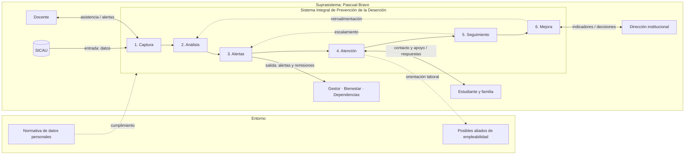
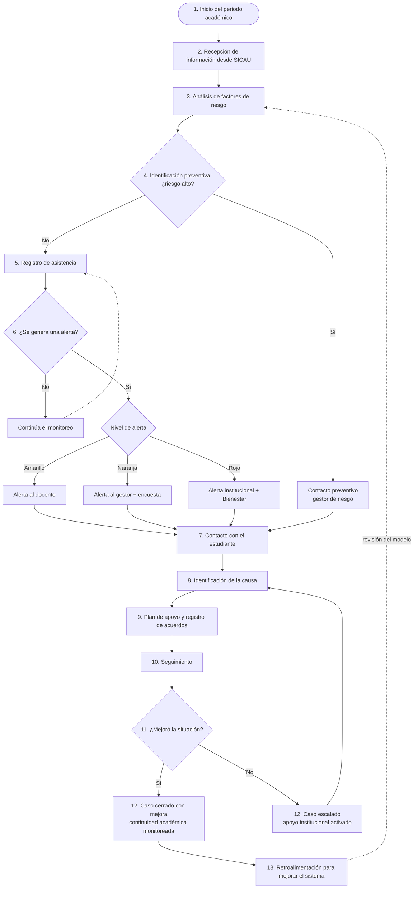

# Sistema Integral de Prevención de la Deserción

Propuesta académica para **identificar a tiempo a estudiantes en riesgo de deserción, acompañarlos y hacerles seguimiento**, analizada desde la **Teoría General de Sistemas (TGS)** y los **roles de Ingeniería de Software**.

> Proyecto de curso · Institución Universitaria Pascual Bravo · Medellín, Colombia

---

## Contenido

- [El problema](#el-problema)
- [La propuesta](#la-propuesta)
- [Vista del sistema (TGS)](#vista-del-sistema-tgs)
- [Componentes funcionales](#componentes-funcionales)
- [Roles de Ingeniería de Software](#roles-de-ingeniería-de-software)
- [Flujo de detección y atención](#flujo-de-detección-y-atención)
- [Propiedades de la TGS](#propiedades-de-la-tgs)
- [Estructura del repositorio](#estructura-del-repositorio)
- [Equipo](#equipo)

---

## El problema

La deserción estudiantil no ocurre de un día para otro. Tiene causas **académicas, económicas, personales, sociales e institucionales**, y casi siempre da señales antes. La más visible es la **inasistencia**.

El sistema busca responder cuatro preguntas:

| Pregunta | Respuesta de la propuesta |
|---|---|
| ¿Cómo se identifica a un estudiante en riesgo? | Con un **riesgo preventivo** (análisis al inicio del periodo) y un **riesgo operativo** (seguimiento de la asistencia). |
| ¿Cómo se contacta y aborda? | Según el nivel de alerta actúa el docente, el gestor de riesgo académico o Bienestar Universitario. |
| ¿Cómo se hace el seguimiento? | Registrando acuerdos y compromisos, y monitoreando la asistencia. |
| ¿Cómo se previene? | Actuando antes de que el estudiante se retire y atendiendo la causa real. |

## La propuesta

Un nuevo software, con su propio frontend, que **usa la información existente en SICAU** (el sistema académico de la universidad) para identificar riesgos y coordinar acciones de apoyo. **No reemplaza a SICAU**: se conecta a él como fuente de datos.

SICAU contiene información académica y socioeconómica, incluida la relacionada con **Presupuesto Participativo**, **Matrícula Cero** y **Política de Gratuidad**.

## Vista del sistema (TGS)

| Nivel | Elementos |
|---|---|
| **Entorno** | Posibles aliados de empleabilidad (Comfama, Comfenalco Antioquia, otras bolsas de empleo — *futuras alianzas, por confirmar*), normativa de protección de datos personales (Ley 1581 de 2012), proveedor de servicios en la nube |
| **Suprasistema** | Institución Universitaria Pascual Bravo |
| **Fuera del software, dentro de la universidad** | SICAU, estudiante y familia, docente, gestor de riesgo académico, Bienestar Universitario, dependencias de apoyo, dirección institucional |
| **Sistema** | Sistema Integral de Prevención de la Deserción |
| **Subsistemas** | Los seis componentes funcionales (ver abajo) |



El diagrama completo y editable está en [`diagramas/prevencion-desercion.drawio`](diagramas/prevencion-desercion.drawio).

## Componentes funcionales

| # | Componente | Qué incluye | Rol responsable |
|---|---|---|---|
| 1 | **Captura de información** | Registro de asistencia, encuestas al estudiante, información de docentes y de SICAU | Frontend · DBA |
| 2 | **Análisis e identificación del riesgo** | Factores académicos, económicos, personales y sociales; riesgo preventivo al inicio del periodo | Data Scientist · Machine Learning |
| 3 | **Alertas** | Riesgo operativo según asistencia; alerta al docente, al gestor e institucional; remisión a Bienestar | Backend |
| 4 | **Atención** | Identificación de la causa, conversación, tutorías, orientación psicológica, apoyo económico, flexibilidad académica, orientación laboral | Frontend · Backend |
| 5 | **Seguimiento** | Acuerdos, compromisos, monitoreo de asistencia, retroalimentación, cierre o escalamiento | Backend · DBA |
| 6 | **Mejora del sistema** | Análisis de resultados, indicadores, retroalimentación institucional, revisión periódica del modelo de riesgo | Data Scientist · Machine Learning |
| — | **Soporte transversal** | Calidad, protección de datos, plataforma y mantenimiento | QA · Seguridad · Cloud · DevOps |

### Niveles de alerta por inasistencia

| Nivel | Faltas* | Quién actúa |
|---|---|---|
| 🟢 Sin alerta | 0–1 | Se continúa monitoreando |
| 🟡 Amarillo | 2–3 | Docente |
| 🟠 Naranja | 4–5 | Gestor de riesgo académico + encuesta al estudiante |
| 🔴 Rojo | 6 o más | Alerta institucional + remisión a Bienestar Universitario |

\* *Rangos ilustrativos y parametrizables por la institución.*

## Roles de Ingeniería de Software

| Rol | Responsabilidad | Recibe | Entrega | Se comunica con |
|---|---|---|---|---|
| **Frontend** | Captura de información y pantallas por perfil | Información del Backend | Registro de asistencia, encuestas, acuerdos, tablero de alertas | Backend, Seguridad |
| **Backend** | Reglas y alertas | Asistencia, encuestas, datos de SICAU | Alertas, notificaciones, gestión de casos | Frontend, DBA, ML, Seguridad |
| **DBA** | Gestión de la información | Datos de SICAU y del sistema | Información organizada, respaldada y confiable | Backend, Data Scientist, Cloud |
| **Data Scientist** | Análisis de factores | Historial de estudiantes | Factores de riesgo e indicadores | DBA, ML, dirección institucional |
| **Machine Learning** | Predicción del riesgo | Factores definidos por el Data Scientist | Nivel de riesgo preventivo; modelo que mejora con cada caso | Data Scientist, Backend |
| **QA** | Pruebas y calidad | Cada nueva versión | Verificación de reglas, pantallas y calidad de datos | Todos los desarrolladores |
| **Seguridad Informática** | Protección de la información | Datos personales y accesos | Acceso según el rol y cumplimiento de la Ley 1581 | Todos, en especial Backend y Cloud |
| **Cloud Engineer** | Plataforma tecnológica | Necesidades de cada componente | Sistema disponible y escalable | DevOps, DBA, Seguridad |
| **DevOps** | Despliegues y mantenimiento | Trabajo de los desarrolladores | Versiones publicadas de forma segura y continua | Todos los desarrolladores, QA, Cloud |

## Flujo de detección y atención



> El sistema **no garantiza** la permanencia del estudiante. Sus resultados posibles son: *caso cerrado con mejora*, *continuidad académica monitoreada*, *caso escalado* o *apoyo institucional activado*.

## Propiedades de la TGS

| Propiedad | Cómo se evidencia |
|---|---|
| **Sinergia** | Ningún rol por sí solo evita la deserción; el resultado depende de todos los componentes trabajando juntos. |
| **Retroalimentación** | Los resultados de cada caso vuelven al análisis y permiten revisar el modelo de riesgo. |
| **Homeostasis** | Cuando la asistencia se sale del rango normal, el sistema activa acciones para recuperar el equilibrio. |
| **Equifinalidad** | El mismo objetivo se alcanza por caminos distintos: tutoría, apoyo económico, orientación psicológica o flexibilidad académica. |
| **Entropía / negentropía** | Sin mantenimiento, los datos se degradan y el modelo pierde precisión; QA, DevOps y la gestión de datos lo contrarrestan. |
| **Frontera** | Separa lo que controla el nuevo software de lo que solo consume (SICAU) o con quién se relaciona (actores y entorno). |
| **Jerarquía / recursividad** | Universidad → Sistema → Componentes → Roles: cada nivel es a su vez un sistema. |

## Estructura del repositorio

```text
.
├── README.md
└── diagramas/
    ├── prevencion-desercion.drawio   # Vista general (TGS) + flujo completo
    └── original.drawio               # Diagrama inicial del equipo
```

Los archivos `.drawio` se abren en [diagrams.net](https://app.diagrams.net) o en la aplicación de escritorio de draw.io. Cada archivo tiene varias pestañas en la parte inferior.


**Curso:** Teoría General de Sistemas + Roles en Ingeniería de Software
**Institución:** Institución Universitaria Pascual Bravo
